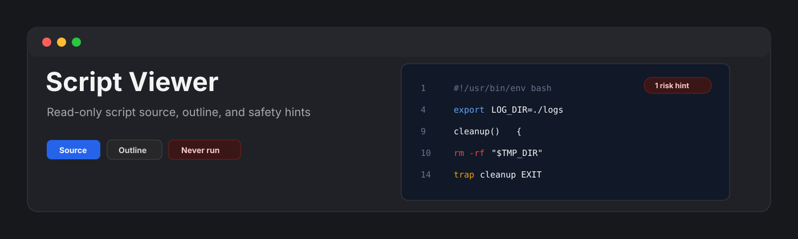
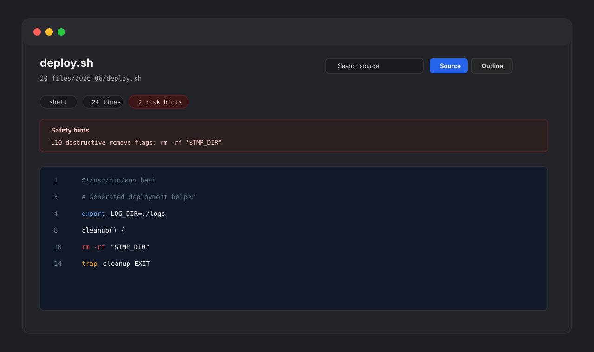

<p align="center">
  
</p>

<p align="center">
  <a href="https://github.com/viggomeesters/obsidian-script-viewer/releases/latest"></a>
  <a href="LICENSE"></a>
  
  
</p>

# Script Viewer

Script Viewer is a read-only Obsidian plugin for inspecting script files without turning them into runnable actions. It opens `.sh`, `.bash`, `.zsh`, `.bat`, `.cmd`, `.ps1`, `.ahk`, `.command`, and `.bats` files with line-numbered source, lightweight syntax hints, outline extraction, search, filtering, and safety-focused summaries.



## Features

- Opens only the supported script extensions listed above.
- Shows stable line numbers with a soft-wrap toggle.
- Detects shebangs and likely interpreters.
- Builds a lightweight outline for shell functions, labels, trap/alias/export/set statements, PowerShell functions, and AutoHotkey hotkeys.
- Highlights comments, strings, variables, command substitutions, paths, URLs, flags, keywords, and risky command patterns.
- Searches source lines and filters outline items.
- Keeps source visible even when syntax is unfamiliar.
- Applies a 10,000 line render cap to keep large scripts responsive.
- Stays read-only by design: it never executes scripts, starts terminals, mutates files, reads the clipboard, or makes network requests.

## Positioning

Existing community options cover broader code workflows:

- Code View provides broad read-only syntax highlighting for many languages.
- Code Files is editor-first and Monaco-based.
- Code Space is a broader code workspace.

Script Viewer is intentionally narrower. It focuses on risky automation artifacts and makes interpreter, environment-variable, executable-looking command, and safety hints visible without providing editing or execution affordances.

## Why never-execute?

Script files can delete data, alter system settings, call remote endpoints, or launch other programs. This plugin is for inspection only. It does not execute code, start subprocesses, open terminals, change permissions, lint, format, save, or call external applications.

## Parser strategy

Script Viewer v0.1 uses local heuristics instead of full language parsers. It detects common shell, batch, PowerShell, and AutoHotkey structures while avoiding hard failures. If a line is unknown, it remains visible as source.

## Development

```bash
npm install
npm run build
npx tsc --noEmit
npm test
```

## Release files

The runtime files are:

- `main.js`
- `manifest.json`
- `styles.css`

## Manual installation

1. Download `main.js`, `manifest.json`, and `styles.css` from the latest release.
2. Create this folder in your vault: `.obsidian/plugins/script-viewer/`.
3. Put the downloaded files in that folder.
4. Reload Obsidian.
5. Enable **Script Viewer** in **Settings -> Community plugins**.

## License

[MIT](LICENSE)
